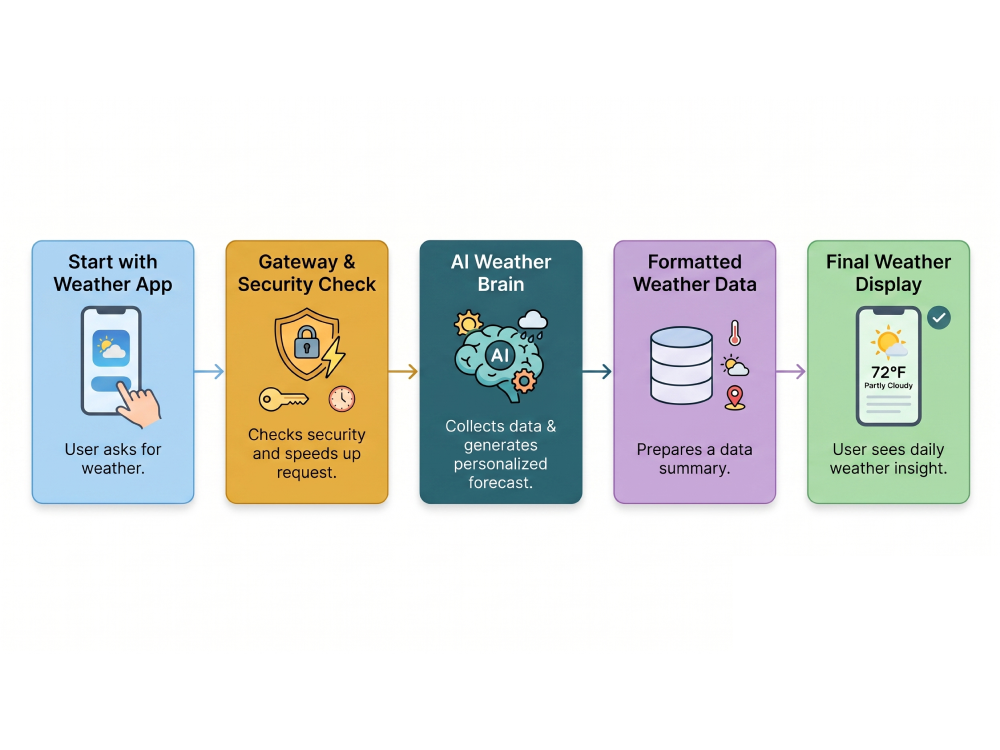

# WeatherAI Dashboard

A small, production-minded weather dashboard built on the WeatherAI API. It shows current conditions and a multi-day forecast for any of several preset locations.
The project is intentionally focused: it does one thing well rather than touching every endpoint. The interesting parts are architectural, not feature-count.


## Why it's built this way

A few deliberate decisions worth calling out:

- **The API key never reaches the browser.** A FastAPI backend acts as a thin proxy. The frontend talks only to our own `/api/weather` route; the `Authorization: Bearer wai_…` header is attached server-side. Putting the key in client JavaScript would expose it to anyone who opens devtools.
- **Responses are cached with a TTL.** The free tier allows 1,000 requests/month. An in-memory TTL cache (default 10 min) means repeated views of the same location cost one upstream request, not dozens — so development and demoing stay well inside quota.
- **Failures degrade gracefully.** Upstream `401`/`429`/timeout/network errors are translated into clear messages instead of a stack trace. The frontend reads fields defensively, so a slightly different response shape won't blank the page.

## Architecture



- `app/main.py` — FastAPI app: routes, upstream client, cache, error handling.
- `templates/index.html` — single-page UI.
- `static/app.js` — fetches from the proxy and renders defensively.
- `static/style.css` — styling.

## Local setup

Requires Python 3.12+.

```bash
# 1. Clone and enter
git clone https://github.com/Robertkip/WeatherAI-API.git
cd WeatherAI-API

# 2. Create a virtual environment
python -m venv .venv
source .venv/bin/activate        # Windows: .venv\Scripts\activate

# 3. Install dependencies
pip install -r requirements.txt

# 4. Configure your key
cp .env.example .env
# edit .env and set WEATHER_API_KEY=wai_your_real_key

# 5. Run
export $(grep -v '^#' .env | xargs)   # load .env (or use python-dotenv / direnv)
uvicorn app.main:app --reload
```

Open http://localhost:8000.

> Get a free API key from the WeatherAI dashboard → **API Keys**. The free tier (1K req/mo) is plenty for this project.

## Configuration

| Variable                  | Default                     | Description                          |
| ------------------------- | --------------------------- | ------------------------------------ |
| `WEATHER_API_KEY`         | _(required)_                | Your `wai_` key                      |
| `WEATHER_API_BASE`        | `https://api.weather-ai.co` | Upstream base URL                    |
| `CACHE_TTL_SECONDS`       | `600`                       | How long to cache a response         |
| `REQUEST_TIMEOUT_SECONDS` | `12`                        | Upstream request timeout             |

## Deployment

The repo includes a `Procfile`, so it deploys as-is to Render or Railway.

**Render**
1. New → Web Service → connect this repo.
2. Build command: `pip install -r requirements.txt`
3. Start command: `uvicorn app.main:app --host 0.0.0.0 --port $PORT`
4. Add environment variable `WEATHER_API_KEY`.

**Railway**
1. New Project → Deploy from GitHub repo.
2. Add `WEATHER_API_KEY` under Variables. The `Procfile` is detected automatically.

A `/health` endpoint is provided for platform health checks.


